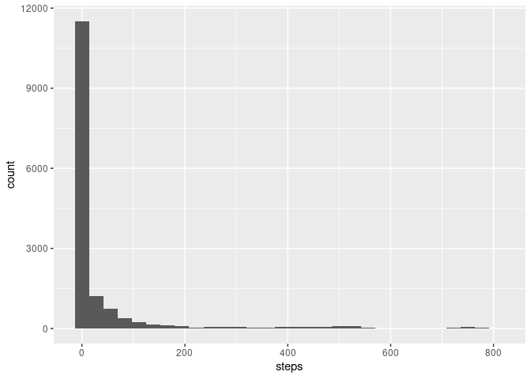
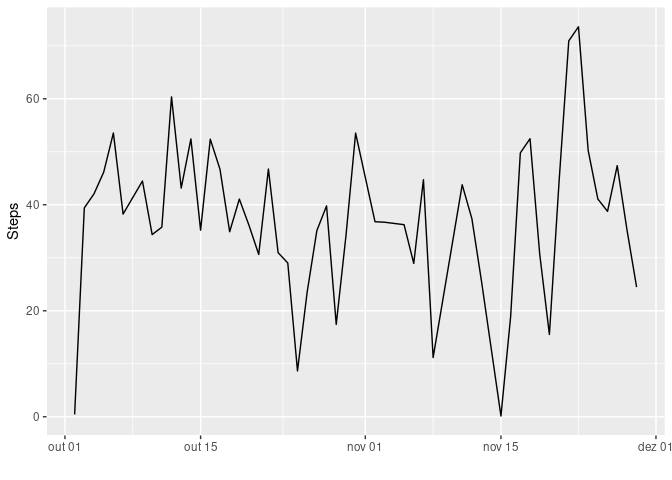
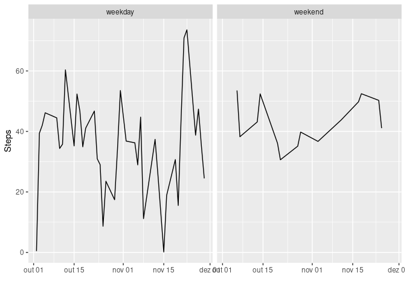

```r
library( tidyverse )
```

```
## ── Attaching packages ──────────────────────────────────────────────────────────────────────────────── tidyverse 1.3.0 ──
```

```
## ✓ ggplot2 3.3.2     ✓ purrr   0.3.4
## ✓ tibble  3.0.3     ✓ dplyr   1.0.2
## ✓ tidyr   1.1.2     ✓ stringr 1.4.0
## ✓ readr   1.3.1     ✓ forcats 0.5.0
```

```
## ── Conflicts ─────────────────────────────────────────────────────────────────────────────────── tidyverse_conflicts() ──
## x dplyr::filter() masks stats::filter()
## x dplyr::lag()    masks stats::lag()
```

```r
library( stargazer )
```

```
## 
## Please cite as:
```

```
##  Hlavac, Marek (2018). stargazer: Well-Formatted Regression and Summary Statistics Tables.
```

```
##  R package version 5.2.2. https://CRAN.R-project.org/package=stargazer
```

```r
library( TSstudio )
library( plotly )
```

```
## 
## Attaching package: 'plotly'
```

```
## The following object is masked from 'package:ggplot2':
## 
##     last_plot
```

```
## The following object is masked from 'package:stats':
## 
##     filter
```

```
## The following object is masked from 'package:graphics':
## 
##     layout
```

```r
library( lubridate )
```

```
## 
## Attaching package: 'lubridate'
```

```
## The following objects are masked from 'package:base':
## 
##     date, intersect, setdiff, union
```

```r
# Loading and preprocessing the data

### Download the dataset to our folder
download.file( "https://d396qusza40orc.cloudfront.net/repdata%2Fdata%2Factivity.zip", 
               destfile = "repdata_data_activity.zip" )

### Unzipping downloaded file
unzip( "repdata_data_activity.zip" )

### Reading downloaded file
project_data <- read_csv( "activity.csv" )
```

```
## Parsed with column specification:
## cols(
##   steps = col_double(),
##   date = col_date(format = ""),
##   interval = col_double()
## )
```

```r
glimpse( project_data )
```

```
## Rows: 17,568
## Columns: 3
## $ steps    <dbl> NA, NA, NA, NA, NA, NA, NA, NA, NA, NA, NA, NA, NA, NA, NA, …
## $ date     <date> 2012-10-01, 2012-10-01, 2012-10-01, 2012-10-01, 2012-10-01,…
## $ interval <dbl> 0, 5, 10, 15, 20, 25, 30, 35, 40, 45, 50, 55, 100, 105, 110,…
```

```r
# What is mean total number of steps taken per day?

### Mean number of steps taken daily
mean( na.omit( project_data$steps ) )
```

```
## [1] 37.3826
```

```r
### Median number of steps taken daily
median( na.omit( project_data$steps ) )
```

```
## [1] 0
```

```r
### Histogram of the total number of steps taken each day
ggplot( project_data, aes( steps ) ) +
        geom_histogram( )
```

```
## `stat_bin()` using `bins = 30`. Pick better value with `binwidth`.
```

```
## Warning: Removed 2304 rows containing non-finite values (stat_bin).
```

<!-- -->

```r
### Summary of dataset
summary( project_data )
```

```
##      steps             date               interval     
##  Min.   :  0.00   Min.   :2012-10-01   Min.   :   0.0  
##  1st Qu.:  0.00   1st Qu.:2012-10-16   1st Qu.: 588.8  
##  Median :  0.00   Median :2012-10-31   Median :1177.5  
##  Mean   : 37.38   Mean   :2012-10-31   Mean   :1177.5  
##  3rd Qu.: 12.00   3rd Qu.:2012-11-15   3rd Qu.:1766.2  
##  Max.   :806.00   Max.   :2012-11-30   Max.   :2355.0  
##  NA's   :2304
```

```r
new_data <- aggregate( steps ~ date, data = project_data, FUN = mean )

glimpse( new_data )
```

```
## Rows: 53
## Columns: 2
## $ date  <date> 2012-10-02, 2012-10-03, 2012-10-04, 2012-10-05, 2012-10-06, 20…
## $ steps <dbl> 0.437500, 39.416667, 42.069444, 46.159722, 53.541667, 38.246528…
```

```r
# What is the average daily activity pattern?

### Time series plot
ggplot( new_data, aes( date, steps ) ) +
        geom_line() +
        scale_x_date( ) + xlab( " " ) + ylab( "Steps" )
```

<!-- -->

```r
### 5 minute interval that contains the maximum number of steps
which.max( new_data$steps )
```

```
## [1] 47
```

```r
new_data[ 4026, ]
```

```
##    date steps
## NA <NA>    NA
```

```r
# Imputing missing values

### Quantity of missing data
sum( is.na( project_data ) )
```

```
## [1] 2304
```

```r
# Are there differences in activity patterns between weekdays and weekends?
project_data <- project_data %>%
                mutate( day = factor( case_when( weekdays( date ) == "sábado" | weekdays( date ) == "domingo" ~ c( "weekend" ),
                                            weekdays( date ) != "sábado" & weekdays( date ) != "domingo" ~ c( "weekday" ) ) ) )

unique( project_data$day )
```

```
## [1] weekday weekend
## Levels: weekday weekend
```

```r
weekday_data <- project_data %>% filter( day == "weekday" )
weekend_data <- project_data %>% filter( day == "weekend" )

weekday_average <- aggregate( steps ~ date, data = weekday_data, FUN = mean )
weekend_average <- aggregate( steps ~ date, data = weekend_data, FUN = mean )

all_averages <- merge( weekday_average, weekend_average, all = TRUE )

all_averages <- all_averages %>%
                mutate( day = factor( case_when( weekdays( date ) == "sábado" | weekdays( date ) == "domingo" ~ c( "weekend" ),
                                                 weekdays( date ) != "sábado" & weekdays( date ) != "domingo" ~ c( "weekday" ) ) ) )

ggplot( data = all_averages, aes( date, steps ) ) +
        geom_line() +
        scale_x_date( ) + xlab( " " ) + ylab( "Steps" ) +
        facet_wrap( ~ day )
```

<!-- -->
